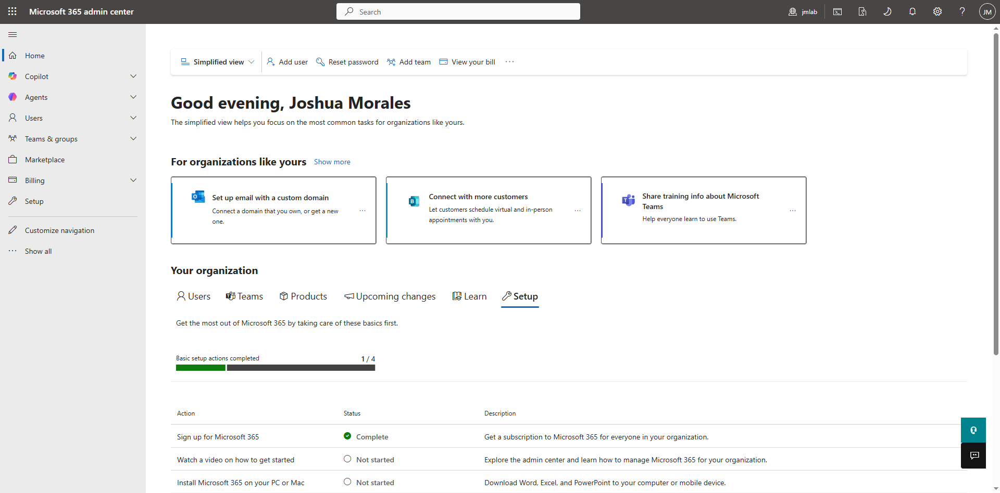
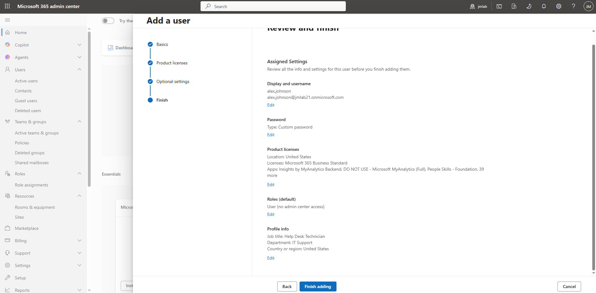
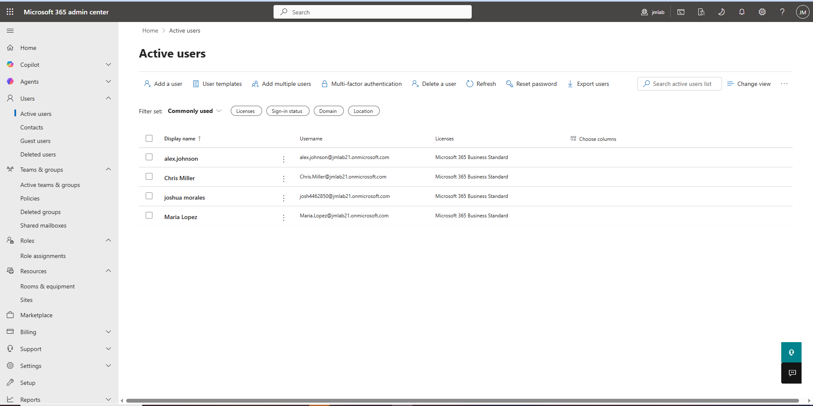
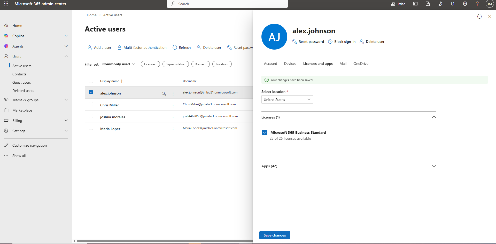
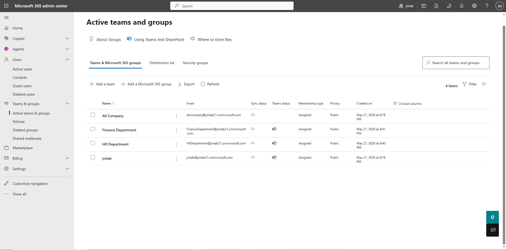
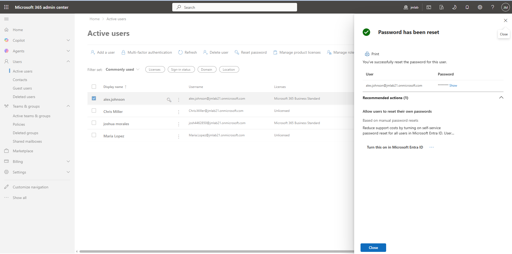
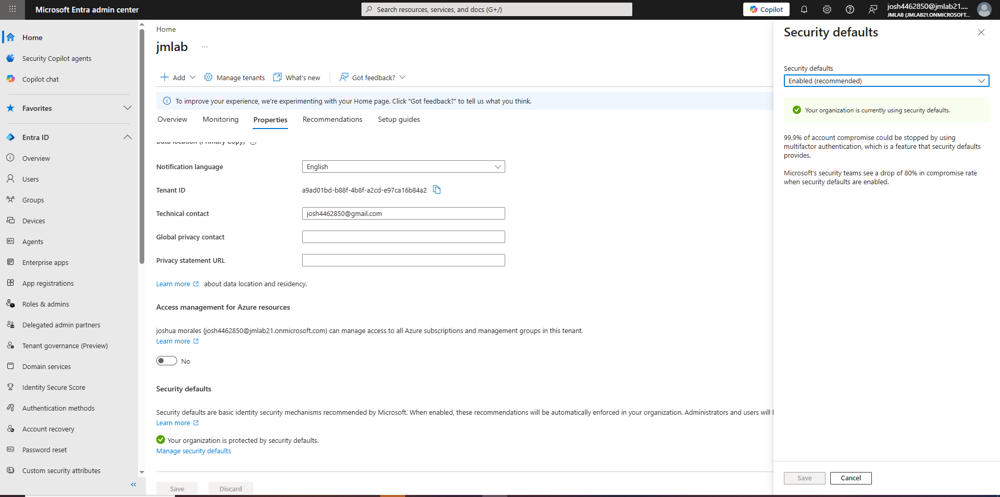
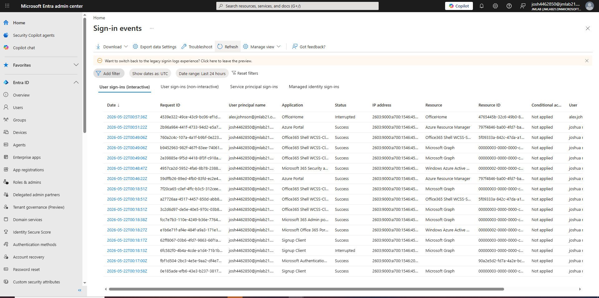

# Microsoft 365 + Entra ID Admin Lab

## Overview
This project demonstrates hands-on Microsoft 365 and Microsoft Entra ID administration tasks in a simulated enterprise cloud environment. The lab focuses on identity management, user administration, MFA enforcement, security group management, password resets, and sign-in monitoring.

---

## Technologies Used
- Microsoft 365 Admin Center
- Microsoft Entra ID
- Microsoft 365 Groups
- Security Groups
- MFA / Security Defaults
- Conditional Access Concepts
- Windows 10/11

---

## Skills Demonstrated
- User provisioning
- Microsoft 365 administration
- Microsoft Entra ID administration
- Password resets
- Security group management
- MFA enforcement
- License assignment
- Identity and access management
- Sign-in monitoring
- Help desk documentation

---

## Lab Tasks Completed
- Created Microsoft Entra ID users
- Assigned Microsoft 365 licenses
- Created security groups
- Added users to department groups
- Reset user passwords
- Enabled Microsoft security defaults
- Reviewed sign-in logs
- Practiced Conditional Access policy concepts
- Documented simulated help desk tickets

---

## Screenshots

### Microsoft Entra Admin Center

### User Creation

### All Users Created

### License Assignment

### Security Group Created

### Department Groups

### Password Reset

### Security Defaults Enabled

### Sign-In Logs

---

## Conditional Access Note

My tenant did not include Conditional Access licensing features. To still practice the security concepts, I reviewed Conditional Access policy configuration structure, report-only deployment recommendations, and MFA enforcement strategies commonly used in enterprise Microsoft 365 environments.

---

## Ticket Documentation

### Ticket 01 — New User Setup
Created a new Microsoft Entra ID user account, assigned a Microsoft 365 license, and added the user to the IT Support security group.

### Ticket 02 — Password Reset
Reset a user's password and required password change at next login.

### Ticket 03 — MFA Enforcement
Enabled Microsoft security defaults to strengthen account security and enforce modern authentication protections.

---

## Key Takeaway
This lab provided practical experience with real-world Microsoft 365 and Microsoft Entra ID administration tasks commonly performed in help desk, desktop support, and junior systems administrator roles.
